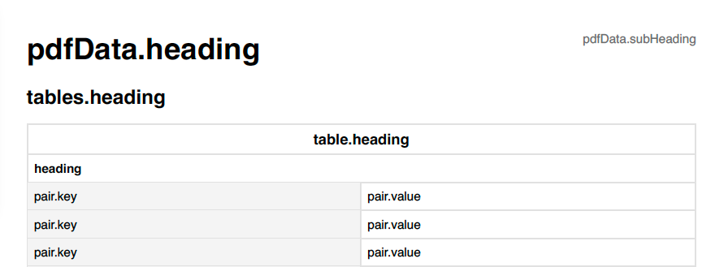
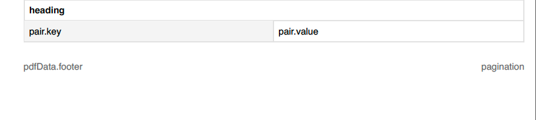

# PDF Export

## Overview

Tool to generate pdfs

## Usage

A PdfData Object is the base of our operations. It has String properties for the heading, subHeading and Footer, as well as an array of PdfGroupedTables.  As seen in the illustrations below, the heading and subheading are placed at the top, the footer at the bottom. 





### PdfDrawElement

Each of the elements on a PDF is a PdfDrawElement. You should create an array of those elements and render the pdf with:

```swift
let format = UIGraphicsPDFRendererFormat()

// The engine to render the PDF
let pdfRenderer = UIGraphicsPDFRenderer(
	bounds: CGRect(
		x: 0,
		y: 0, 
		width: 595.28, // A4 Paper Size
		height: 841.89 // A4 Paper Size
	 ),
	format: format
)
			
let data = pdfRenderer.pdfData { context in
	// Loop over all the elements and draw them
	elements.forEach { drawElement in
  	// Draw the pdf element onto the canvas
		drawElement.draw(context)
	}
}

let document = PDFDocument(data: data) // <- this is the PDF Document you want.
```


---

## Contribution process

The development team works on the repository in a private fork (for reasons of compliance with existing processes) and shares its work as often as possible.

If you plan to make non-trivial changes, we recommend to open an issue beforehand where we can discuss your planned changes. This increases the chance that we might be able to use your contribution (or it avoids doing work if there are reasons why we wouldn't be able to use it).

Note that all commits should be signed using a [gpg key](https://docs.github.com/en/authentication/managing-commit-signature-verification/adding-a-gpg-key-to-your-github-account).

---

## License

License is released under the EUPL 1.2 license. See [LICENSE](https://github.com/minvws/nl-mgo-app-ios?tab=License-1-ov-file#readme) for details.
