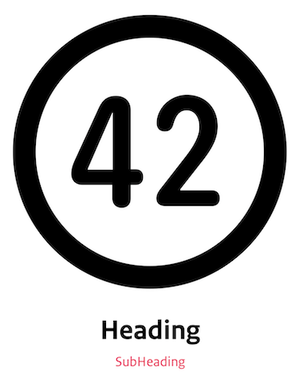

# Reuseable UI

## Overview

This package holds a small collection of reuseable visual elements

## Usage

### Accordion

A classic accordion, to expand or collapse a detail view

```swift
import ReusebleUI 
struct DetailView: View {	
	var body: some View {
		VStack {
			AccordionView("First section", startOpen: true) {
			  Text("Details First Section. Starts expanded.")
			  ...
			}
		  
			AccordionView("Second section") {
			  Text("Details Second Section. Starts collapsed.")
				...
		  }
		}
	}
}
```


### BlurView

A helper for using the UIKit UIBlurEffect in SwiftUI

```swift
import ReusebleUI 

Text("BlurEffect")
	.background(BlurView(style: .systemUltraThinMaterial))

```

### Button

The main call to action button is available in nine flavors:

```swift
import ReusebleUI 
struct ButtonView: View {	
	var body: some View {
		VStack {
			CallToActionButton(".primaryWithLeadingIcon", icon: Image(systemName: "stethoscope"), style: .primaryWithLeadingIcon)
			.padding(16)
		CallToActionButton(".primaryWithLeadingSpinner", style: .primaryWithLeadingSpinner)
			.padding(16)
		CallToActionButton(".solid", style: .solid)
			.padding(16)
		CallToActionButton(".tonal", style: .tonal)
			.padding(16)
		CallToActionButton(".ghost", style: .ghost)
			.padding(16)
		CallToActionButton(".withIcon", icon: Image(systemName: "stethoscope"), style: .withIcon)
			.padding(16)
		CallToActionButton(".withSpinner", style: .withSpinner)
			.padding(16)
		}
	}
}
```


### Card

One common element in the UI is to make a view look like a card. The `.cardify()` modifier makes any view look like a card. 

For errors and and other feedback, we have a NotificationCard with an image, title and message. 


You can apply it to any view, Here is an example of a button:


### Haptic Feedback

Whenever you want to give some haptic feedback to the user, you can use `Haptic.light()`, `Haptic.medium()` or `Haptic.heavy()`

There is a viewModifier variant, `Text("Press me").hapticFeedback(HapticFeedback.medium)`

### Feedback Toast

Another way to display feedback to the user is through a toast. 

```swift

VStack {
	ToastView(Feedback(title: "Title", subtitle: "Text", type: .info))
	ToastView(Feedback(title: "Title", subtitle: "Text", type: .warning))
	ToastView(Feedback(title: "Title", subtitle: "Text", type: .error))
	ToastView(Feedback(title: "Title", subtitle: "Text", type: .success)) {
		// Action when underlined Text is clicked
	}
}
```

There are four different types of Toast: **.info**, **.warning**, **.error** and **.success**


### ConfirmationAlert

A styled confirmation dialog that replaces the system `.alert` when custom styling is needed. It renders as a full-screen cover with a dimmed backdrop and a card — Liquid Glass on iOS 26+, themed tertiary background on earlier versions. The cover fades in and out; swipe-to-dismiss is disabled so the user must tap a button.

Use the `.confirmationAlert` view modifier:

```swift
.confirmationAlert(
    heading: String(localized: "delete.dialog.heading"),
    subheading: String(localized: "delete.dialog.subheading"),
    actionText: String(localized: "delete.dialog.confirm"),
    cancelText: String(localized: "common.cancel"),
    isPresented: $showDeleteAlert,
    onConfirm: { viewModel.reduce(.deleteItem) }
)
```

Set `isPresented` to `true` inside `withTransaction { $0.disablesAnimations = true }` to suppress the UIKit full-screen cover slide-in animation:

```swift
var transaction = Transaction()
transaction.disablesAnimations = true
withTransaction(transaction) { showDeleteAlert = true }
```

When using an optional binding (e.g. a selected item), derive a `Binding<Bool>` with `.presence()` and read the value inside `onConfirm` — it is guaranteed to be non-nil at that point:

```swift
.confirmationAlert(
    heading: String(format: String(localized: "confirm.dialog.heading"), item?.name ?? ""),
    ...
    isPresented: $selectedItem.presence(),
    onConfirm: {
        if let item = selectedItem { viewModel.reduce(.confirm(item)) }
    }
)
```

### ConditionalViewModifier

You can not aways use an **if** statement in a view, especially when using view modifiers, hence the conditionalViewModifier. 
*Note that there is no **else** option.* 

```swift
Text("ConditionalViewModifier")
		.when(state == .warning, transform: { view in
			view.foregroundStyle(.orange)
		})
```

### DetailRow

A simple view to display details, containing a title and a body

```swift
DetailRow(title: "The Title", content: "The Content") .padding(16).border(Color.black).padding(16)
```


### SplittedText

Large bodies of text are read by Voice Over as one continuous block. There is the SplittedText view that breaks that down to a list of indivudual Text elements, that are read one by one by Voice Over.

Params are the spacing between the rows, and the alignment of the Text. 

```swift
VStack {
		SplittedText("Content\nContent\nMore Content", spacing: 8, alignment: .center)
				.padding(.bottom, 16)
		
		SplittedText("Content\nContent\nMore Content", spacing: 3, alignment: .leading)
}
```


### ImageContentView

A reoccurring view in our project is a large image with content underneath.

```swift
	ImageContentView(
		icon: Image(systemName: "42.circle"),
		heading: "Heading",
		subHeading: "SubHeading",
		textAlignment: .center,
		textSpacing: 8,
		titleStyle: .headingExtraLarge,
		subHeadingForegroundColor: Color.pink
	)

``` 



---

## Contribution process

The development team works on the repository in a private fork (for reasons of compliance with existing processes) and shares its work as often as possible.

If you plan to make non-trivial changes, we recommend to open an issue beforehand where we can discuss your planned changes. This increases the chance that we might be able to use your contribution (or it avoids doing work if there are reasons why we wouldn't be able to use it).

Note that all commits should be signed using a [gpg key](https://docs.github.com/en/authentication/managing-commit-signature-verification/adding-a-gpg-key-to-your-github-account).

---

## License

License is released under the EUPL 1.2 license. See [LICENSE](https://github.com/minvws/nl-mgo-app-ios?tab=License-1-ov-file#readme) for details.
