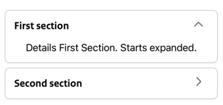
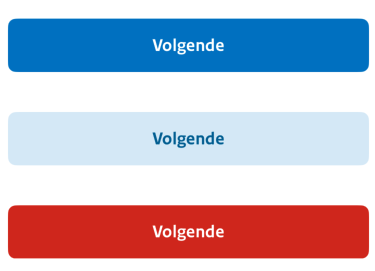
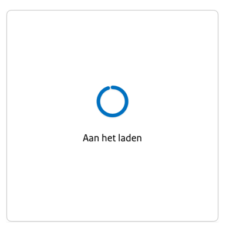
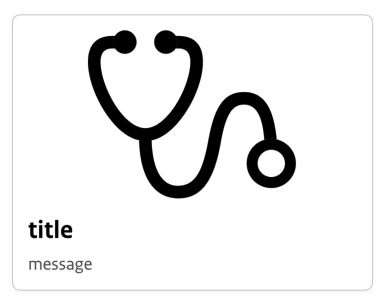
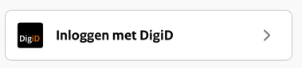
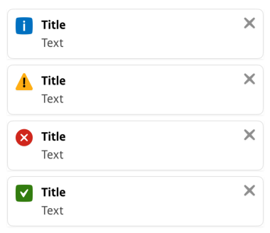
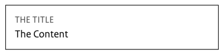
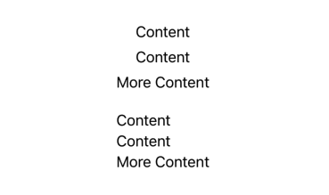

# Reuseable UI

## Overview

This package holds a small collection of reuseable visual elements

## Usage

### Accordion

A classic accordion, to expand or collapse a detail view

```swift
import ReusebleUI 
struct DetailView: View {	
	var body: some View {
		VStack {
			AccordionView("First section", startOpen: true) {
			  Text("Details First Section. Starts expanded.")
			  ...
			}
		  
			AccordionView("Second section") {
			  Text("Details Second Section. Starts collapsed.")
				...
		  }
		}
	}
}
```



### Button

The main call to action button is available in three flavors:

```swift
import ReusebleUI 
struct ButtonView: View {	
	var body: some View {
			VStack {
				CallToActionButton("onboarding_action", style: .primary)
					.padding(16)
				CallToActionButton("onboarding_action", style: .secondary)
					.padding(16)
				CallToActionButton("onboarding_action", style: .destructive)
					.padding(16)
			}
		}
	}
}
```



### Card

One common element in the UI is to make a view look like a card. The `.cardify()` modifier makes any view look like a card. 

A much used loader has its own LoadingCardView with a title:



For errors and and other feedback, we have a NotificationCard with an image, title and message. 



You can apply it to any view, Here is an example of a button:




### Circular Progress View

To draw a circular progress view, you call 

```swift
	CircularProgressView(progress: 0.25, lineWidth: 6)
		.frame(width: 50, height: 50)
```

Which draws something like


### Haptic Feedback

Whenever you want to give some haptic feedback to the user, you can use `Haptic.light()`, `Haptic.medium()` or `Haptic.heavy()`

There is a viewModifier variant, `Text("Press me").hapticFeedback(HapticFeedback.medium)`

### Toast

A simple view to diplay feedback to the user. 

```swift
import ReuseableUI

class ContentViewModel: ObservableObject {

  /// A list of all the actions this viewModel can handle
	enum Action {
		case closeToast
	}
	
	/// Any toast to display?
	@Published var toast: Toast?
	
	/// Intitializer
	/// - Parameter showToast: should we show a toast
	init(showToast: Bool = false) {
		if showToast {
			toast = Toast(
				title: String(localized: "title"),
				subtitle: String(localized: "subtitle"),
				type: .success
			)
		}
	}
	
	/// Handle any action
	/// - Parameter action: the action to be handled
	func reduce(_ action: ContentViewModel.Action) {
		switch action {
			case .closeToast:
				toast = nil
		}
	}
}

struct ContentView: View {
	
	/// The view model
	@StateObject var viewModel: ContentViewModel
	...
  var body: some View {
	  if let toast = viewModel.toast {
			
		  ToastView(toast) {
			 // User pressed on the close button
			  withAnimation {
				  viewModel.reduce(.closeToast)
			 }
		 }
	 }
    ...
 }
}
```

There are four different types of Toasts: **.info**, **.warning**, **.error** and **.success**




### ConditionalViewModifier

You can not aways use an **if** statement in a view, especially when using view modifiers, hence the conditionalViewModifier. 
*Note that there is no **else** option.* 

```swift
Text("ConditionalViewModifier")
		.if(state == .warning, transform: { view in
			view.foregroundStyle(.orange)
		})
```


### DetailRow

A simple view to display details, containing a title and a body

```swift
DetailRow(title: "The Title", content: "The Content") .padding(16).border(Color.black).padding(16)
```



### SplittedText

Large bodies of text are read by Voice Over as one continuous block. There is the SplittedText view that breaks that down to a list of indivudual Text elements, that are read one by one by Voice Over.

Params are the spacing between the rows, and the alignment of the Text. 

```swift
VStack {
		SplittedText("Content\nContent\nMore Content", spacing: 8, alignment: .center)
				.padding(.bottom, 16)
		
		SplittedText("Content\nContent\nMore Content", spacing: 3, alignment: .leading)
}
```




## Contribution process

The development team works on the repository in a private fork (for reasons of compliance with existing processes) and shares its work as often as possible.

If you plan to make non-trivial changes, we recommend to open an issue beforehand where we can discuss your planned changes. This increases the chance that we might be able to use your contribution (or it avoids doing work if there are reasons why we wouldn't be able to use it).

Note that all commits should be signed using a [gpg key](https://docs.github.com/en/authentication/managing-commit-signature-verification/adding-a-gpg-key-to-your-github-account).

## License

License is released under the EUPL 1.2 license. See [LICENSE.txt](https://github.com/minvws/nl-mgo-app-ios-private/blob/main/LICENSE.txt) for details.
