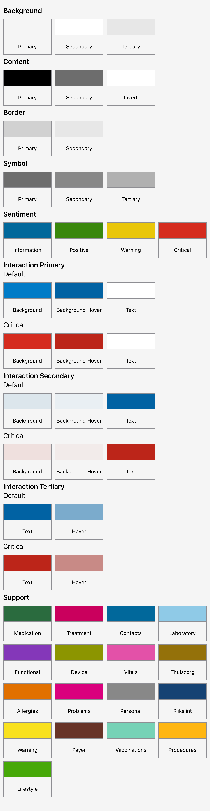
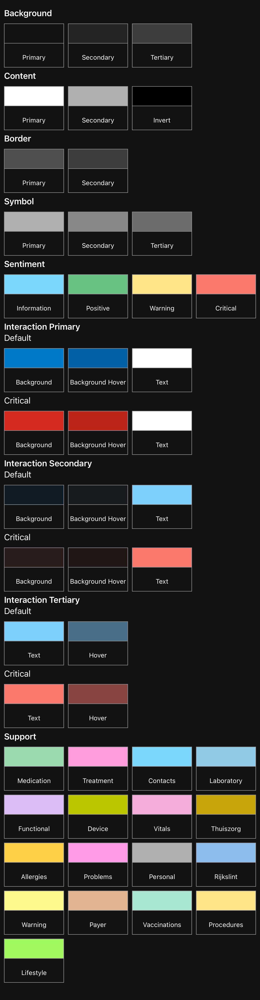

# Theme

## Overview

This theme covers all the colors available for the MijnGezondheidOverzicht app. A picture is worth a thousand words.
Light Mode | Dark Mode
--|--
 | 


## Usage

The theme is available as an evironment variable.

```swift
	/// The Theme
	@Environment(\.theme) var theme
```

It can be used in Views like so:

```swift
Text("Hello, World!")
	.foregroundStyle(theme.contentPrimary)
```

This will produce a Text object with text color #000000 when in Light Mode, or #FFFFFF in Dark Mode. 

---

## Contribution process

The development team works on the repository in a private fork (for reasons of compliance with existing processes) and shares its work as often as possible.

If you plan to make non-trivial changes, we recommend to open an issue beforehand where we can discuss your planned changes. This increases the chance that we might be able to use your contribution (or it avoids doing work if there are reasons why we wouldn't be able to use it).

Note that all commits should be signed using a [gpg key](https://docs.github.com/en/authentication/managing-commit-signature-verification/adding-a-gpg-key-to-your-github-account).

---

## License

License is released under the EUPL 1.2 license. See [LICENSE.txt](https://github.com/minvws/nl-mgo-app-ios-private/blob/main/Packages/Theme/LICENSE.txt) for details..
