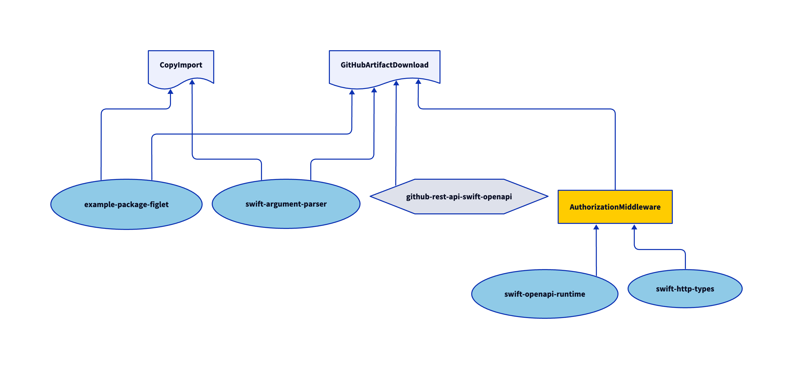

# My Health Overview - iOS

## Introduction

This repository contains the iOS release of the My Health Overview project.

* The iOS app is located in the repository you are currently viewing.
* The Android app can also be [found on GitHub](https://github.com/minvws/nl-mgo-app-android-private).

See minvws/**[nl-rdo-mgo-coordination-private](https://github.com/minvws/nl-rdo-mgo-coordination-private)** for further technical documentation.

## Disclaimer

This project and all associated code serve solely as documentation
and demonstration purposes to illustrate potential system
communication patterns and architectures.

This codebase:

- Is NOT intended for production use
- Does NOT represent a final specification
- Should NOT be considered feature-complete or secure
- May contain errors, omissions, or oversimplified implementations
- Has NOT been tested or hardened for real-world scenarios

The code examples are only meant to help understand concepts and demonstrate possibilities.

By using or referencing this code, you acknowledge that you do so at your own
risk and that the authors assume no liability for any consequences of its use.

---

## About the App

### Dependencies

There are a number of Swift Packages in `Packages/`, which the app target depends on. Here is the dependency graph: 

The majority of our (third-party) dependencies are included as Swift Packages. Here is an overview of what dependencies are used and why.

* [AuthorizationMiddleware](https://github.com/minvws/nl-mgo-app-ios-private/tree/main/Packages/AuthorizationMiddleware/README.md): Basic Authentication Middleware for the open-api generator.
* [CopyImport](https://github.com/minvws/nl-mgo-app-ios-private/tree/main/Packages/CopyImport/README.md): script to assist with importing copy.
* [FeatureFlag](https://github.com/minvws/nl-mgo-app-ios-private/tree/main/Packages/FeatureFlag/README.md): some of the features of the application are locked behind a feature flag. This package controls those flags.
* [FHIRClient](https://github.com/minvws/nl-mgo-app-ios-private/tree/main/Packages/FHIRClient/README.md): the client for all API calls to fetch the FHIR data. 
* [FileStorage](https://github.com/minvws/nl-mgo-app-ios-private/tree/main/Packages/FileStorage/README.md): helper to store and read files from local disk.
* [JailBreakDetector](https://github.com/minvws/nl-mgo-app-ios-private/tree/main/Packages/JailBreakDetector/README.md): helper to detect jail broken devices.
* [GitHubArtifactDownload](https://github.com/minvws/nl-mgo-app-ios-private/tree/main/Packages/GitHubArtifactDownload/README.md): script to assist with downloading the latest artifact for the Shared Core
* [LocalAuthenticationProvider](https://github.com/minvws/nl-mgo-app-ios-private/tree/main/Packages/LocalAuthenticationProvider/README.md): class to authenticate with face id or touch id.
* [LocalisationService](https://github.com/minvws/nl-mgo-app-ios-private/tree/main/Packages/LocalisationService/README.md): open-api generated class to search for healthcare providers.
* [Logging](https://github.com/minvws/nl-rdo-app-ios-modules): a tool for Logging, reused from CoronaCheck.
* [MGORepository](https://github.com/minvws/nl-mgo-app-ios-private/tree/main/Packages/MGORepository/README.md): The linking class between the ZIBs, the FHIR Parser and the FHIR Client.
* [NavigationStackBackport](https://github.com/lm/navigation-stack-backport): backport of the iOS 16 NavigationStack to iOS 15.
* [NotificationCenter](https://github.com/minvws/nl-mgo-app-ios-private/tree/main/Packages/NotificationCenter/README.md): helper protocol for the Notification Center.
* [Observatory](https://github.com/minvws/nl-mgo-app-ios-private/tree/main/Packages/Observatory/README.md): helper class to fascilitate subscription to changes.
* [RemoteAuthentication](https://github.com/minvws/nl-mgo-app-ios-private/tree/main/Packages/RemoteAuthentication/README.md): helper class that helps with DigiD login. 
* [RemoteConfiguration](https://github.com/minvws/nl-mgo-app-ios-private/tree/main/Packages/RemoteConfiguration/README.md): On startup of the app, a remote configuration is fetched with the latest app settings.
* [RestrictedBrowser](https://github.com/minvws/nl-mgo-app-ios-private/tree/main/Packages/RestrictedBrowser/README.md): Downside of an in-app browser is the loss of Parental Control. As a solution, we came up with a restricted browser. While surfing the allowed domain, you remain in the in-app browser. When you navigate to another domain, you are redirected to the default browser.
* [ReusableUI](https://github.com/minvws/nl-mgo-app-ios-private/tree/main/Packages/ReusableUI/README.md): Downside of This package holds a small collection of reuseable visual elements.
* [RijkoverheidFont](https://github.com/minvws/nl-mgo-app-ios-private/tree/main/Packages/RijksoverheidFont/README.md): helper for using the Rijksoverheid font
* [Sanitizer](https://github.com/minvws/nl-mgo-app-ios-private/tree/main/Packages/Sanitizer/README.md): helper to remove malicious user input. 
* [SecureUserSettings](https://github.com/minvws/nl-mgo-app-ios-private/tree/main/Packages/SecureUserSettings/README.md): helper to safely persist user settings. 
* [SharedCore](https://github.com/minvws/nl-mgo-app-ios-private/tree/main/Packages/SharedCore/README.md): the shared javascript library to parse FHIR data into Zorg Informatie Bouwstenen.
* [Theme](https://github.com/minvws/nl-mgo-app-ios-private/tree/main/Packages/Theme/README.md): helper with all the styles and colors for the application

#### Development only

* [XcodeGen]([https://github.com/yonaskolb/XcodeGen]): Command Line tool to generate an Xcode projectfile based on a [project.yml](/.project.yml) description file. The .xcodeproj file that is generated by this tool is not checked into the git repository but has to be created when checking out the code by running `make generate_project`.
- [D2](https://d2lang.com/) for generating dependency graphs. Use `make generate_diagrams` to generate new diagrams for the dependency graphs.
- [quicktype](https://github.com/glideapps/quicktype) for generating the shared core for paring FHIR data. `make import_sharedcore`

#### Testing only

A graph with all the test dependencies.

* [HTTPStubs](https://github.com/AliSoftware/OHHTTPStubs): a library designed to stub your network requests very easily.
* [Nimble](https://github.com/Quick/Nimble): testing framework to express expectations using a natural, easily understood language
* [SnapshotTesting](https://github.com/pointfreeco/swift-snapshot-testing): tool to help creating snapshots
* [ViewInspector](https://github.com/nalexn/ViewInspector): a library for unit testing SwiftUI views

#### Continuous Integration only

* [Fastlane](https://github.com/fastlane/fastlane): for automating the build and distribution pipeline.
* [SwiftLint](https://github.com/realm/SwiftLint): a tool to enforce Swift style and conventions.

---

## Development

### Build Requirements

To build and develop the app you need:

- Xcode 16
- Xcode Command Line tools (Specifically "Make").
- [Homebrew](https://brew.sh/)
- [Git](https://git-scm.com/)

### Getting started

The Xcode project file ([MGO.xcodeproj](MGO.xcodeproj)) is not checked-in to git. Instead, we generate it dynamically using [XcodeGen](https://github.com/yonaskolb/XcodeGen) based on [project.yml](/.project.yml). 

There is a [Makefile](./Makefile) which makes it easy to get started (if you encounter any issues running this, please do open an issue):

Simply run `make dev` from the command line.  

It will use [Homebrew](https://brew.sh) to install [these tools](./Brewfile), and will install githooks for:

* GitLFS (which will download the [snapshot](https://github.com/pointfreeco/swift-snapshot-testing) PNGs used in our unit tests)
* XcodeGen (which will update the Xcode project each time you change branches)

It will run `bundle install` to setup your [Ruby dependencies](./Gemfile) such as [fastlane](https://fastlane.tools).

Lastly, it will generate and open the Xcode Project for you. You should run the `MGO Dev` scheme targetting a simulator to get started..

### Continuous Integration & reproducible builds

In order to facilitate CI and reproducible builds, this codebase can be built using Github Actions.

### SharedCore

Transforming the FHIR data into Zorg Informatie Bouwstenen is handled by a [shared JavaScript Core](https://github.com/minvws/nl-mgo-app-web-private/actions/workflows/package-fhir-data.yml). A verion of that core is included in the app. If you want to build a new version of the shared core for the app, you need to install [quicktype](https://github.com/glideapps/quicktype) `npm install -g quicktype` and run `make import_sharedcore`. You'll need a [private GitHub API key](https://docs.github.com/en/apps/creating-github-apps/authenticating-with-a-github-app/managing-private-keys-for-github-apps) for this to work. 

### End 2 End Tests

See [End 2 End Tests](./MGOUITests/E2E.md) for more information about the end to end tests. 

---

## Release Procedure

We use fastlane to automate our release processes, and that is executed by GitHub Actions. See [.github/workflows](.github/workflows) for the workflows definition files.

We release test, acceptance and production-like builds internally to Firebase App Distribution. These are triggered whenever there is a commit made to the main branch (ie by merging a pull request).

You can also manually trigger this release process manually, by running the [Deploy: Firebase (manual)](.github/workflows/deploy-firebase-manual.yml) github action and providing a branch name.

Once it is time to start the release train, create a release branch with the format `release/release-4.7.0`, and then increment the `MARKETING_VERSION` for the app in [project.yml](./project.yml). Pushing to this branch will trigger the appropriate Firebase builds.

Once the team is satisfied with the quality of the builds on Firebase, a production build can be sent to TestFlight. A release to TestFlight is kicked off by *tagging* a commit using this format:

`Release-4.7.0-RC1`, `Release-4.7.0-RC2`, etc.

Here we perform a manual regression test on the build to make sure the production-ready binary performs as expected.

Once the build is approved by Apple, we release the approved build manually using a phased rollout to give us the opportunity to spot any crashes that might be detected, or bugs that might be reported. At this point  a final tag should be made, with this format:

`Release-4.7.0`

Now that the release is completed, the private git repository should be "synced" with the public reposititory by running `make sync_repo`. It pushes new *non-RC* tags to the public repository. This command is part of the [RDO Repository Tools](https://github.com/minvws/nl-rdo-git-repository-tool). 

---

## Contribution process

The development team works on the repository in a private fork (for reasons of compliance with existing processes) and shares its work as often as possible.

If you plan to make non-trivial changes, we recommend to open an issue beforehand where we can discuss your planned changes. This increases the chance that we might be able to use your contribution (or it avoids doing work if there are reasons why we wouldn't be able to use it).

Note that all commits should be signed using a [gpg key](https://docs.github.com/en/authentication/managing-commit-signature-verification/adding-a-gpg-key-to-your-github-account).

---

## License

This repository follows the [REUSE Specfication v3.0](https://reuse.software/spec/). Please see [REUSE.toml](./REUSE.toml) and the individual `*.license` files for copyright and license information.
